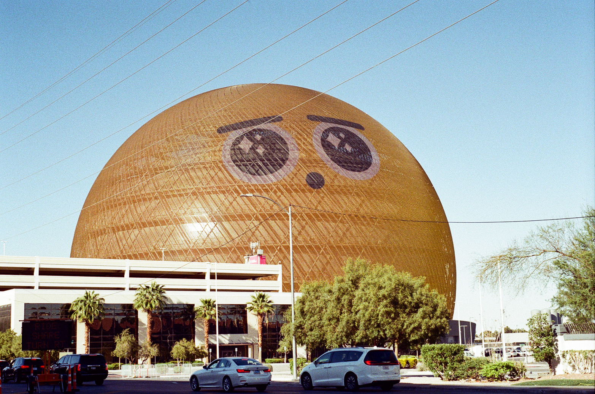
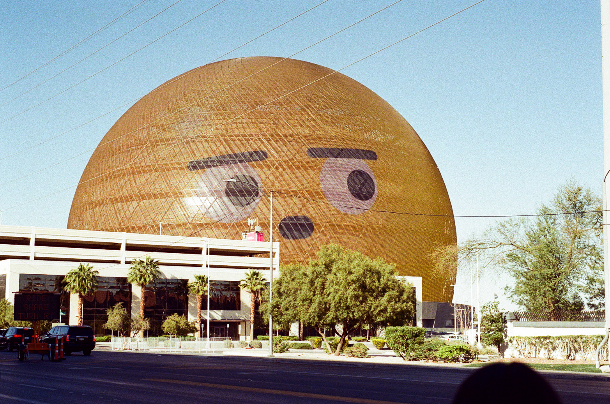
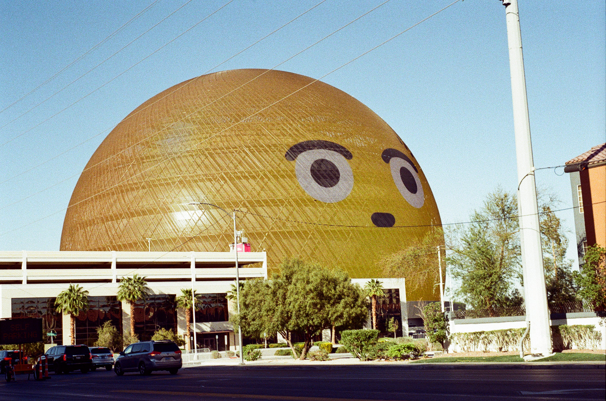
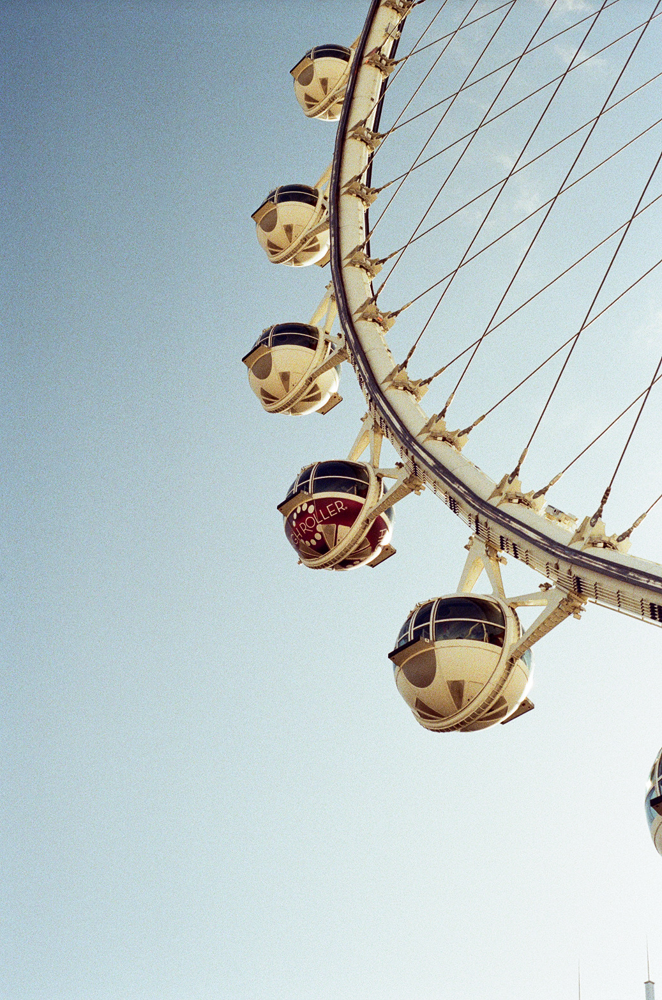
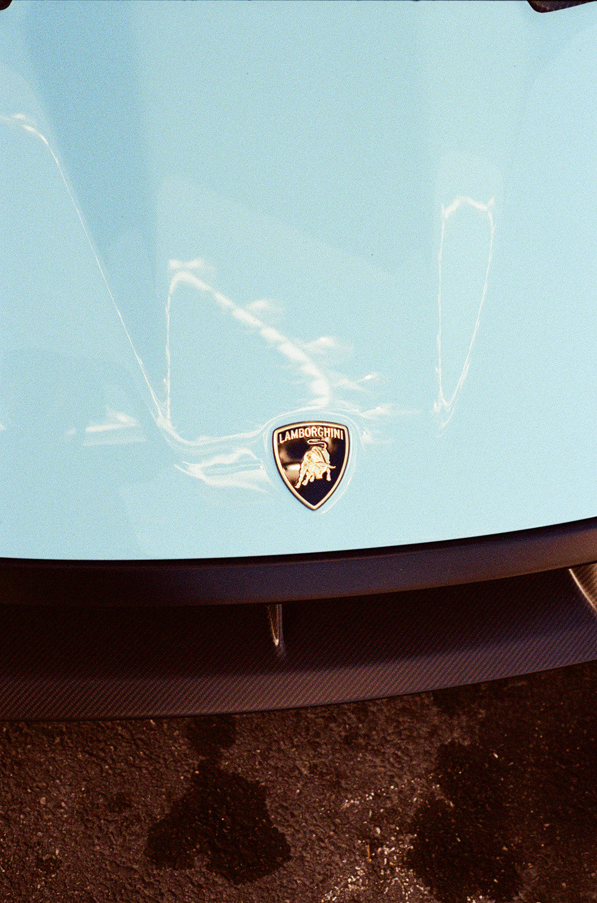
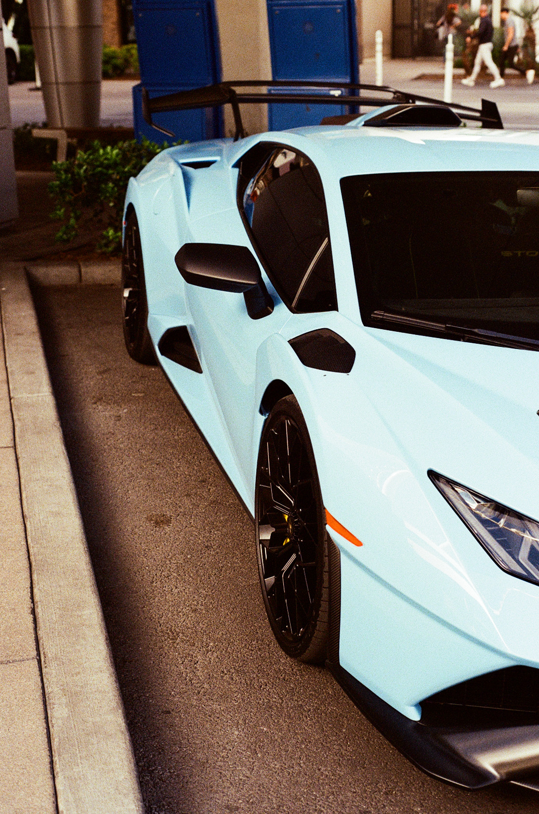
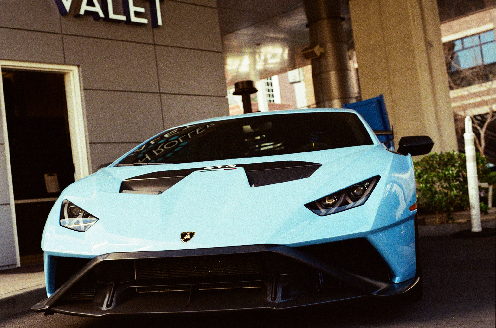

+++
title = "Las Vegas Trip"
date = 2024-07-13
description = "Amazing photos from my trip to Las Vegas - the lights, the energy, and the unforgettable moments"
[taxonomies]
tags = ["travel", "las-vegas", "photography", "city", "lights"]
[extra]
cover_image = "/images/lasvegas/240713000078230003.jpg"
+++

# Las Vegas - The City That Never Sleeps

My recent trip to Las Vegas was absolutely incredible! From the dazzling lights of the Strip to the amazing architecture and vibrant atmosphere, every moment was photo-worthy.

*The iconic Las Vegas skyline*

## The Strip Experience

Walking down the Las Vegas Strip is like entering a different world. The energy is electric, and there's something amazing to capture at every turn.

## More Highlights

## Camera Details

- Camera: Digital Camera
- Date: July 13, 2024
- Location: Las Vegas, Nevada
- Weather: Perfect clear skies

This trip to Las Vegas was unforgettable. The combination of architecture, lights, and atmosphere made it a photographer's paradise!
